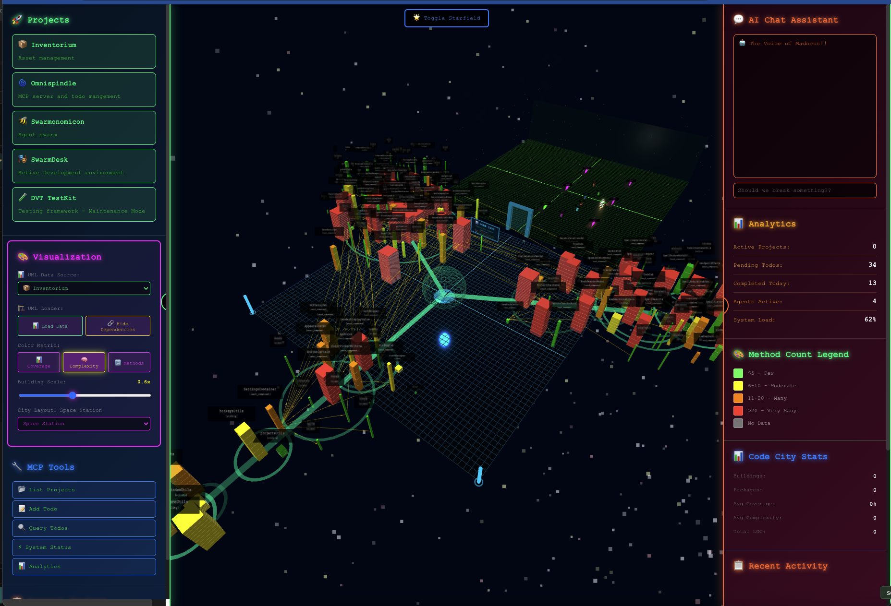
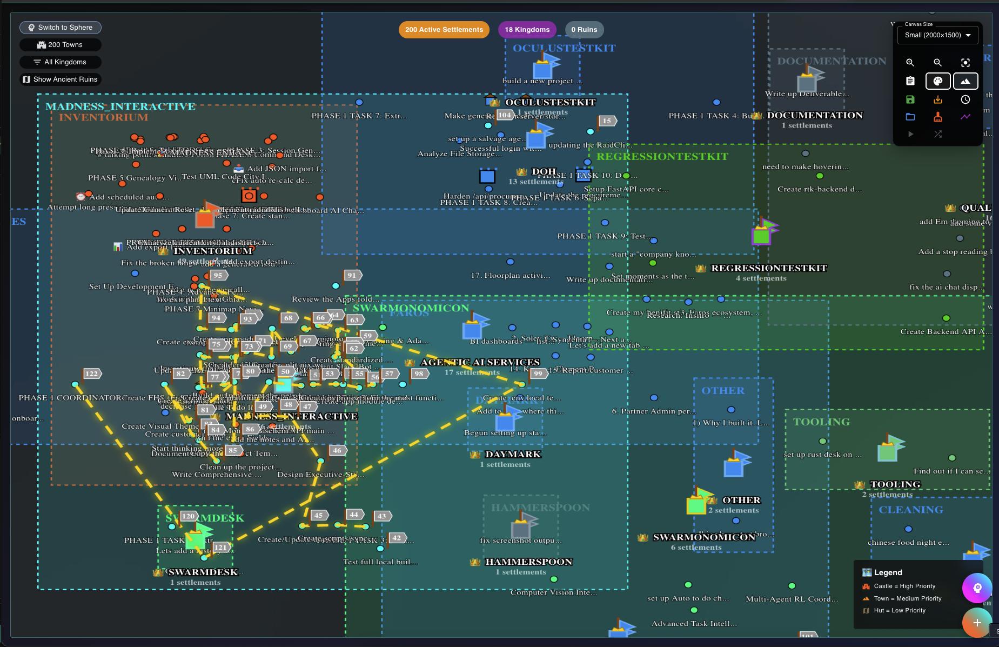

# Inventorium

**3D workspace dashboard and project management interface**



The visual layer of the Madness Interactive ecosystem. Web-based dashboard that connects humans to AI-managed work through immersive 3D project environments and real-time data visualization. More lightweight than a Jira ticket, but 

## What it provides

**Dashboard Interface:**
- Real-time todo and project visualization
- Enhanced Mindmap (TANGENTRON): 2D neural pathway visualization
- War Room Map: RPG-style productivity adventure interface
- Direct API access for fast data operations
- Analytics and progress tracking
- Auth0 integration with demo fallbacks

**3D Project Workspaces (SwarmDesk):**


- Individual project environments with context isolation
- Embedded Claude Code interface for AI development assistance
- Mouse drag navigation with standardized controls
- Project-aware working directories and tool configuration

**Integration Layer:**
- **API Mode**: HTTP calls to madnessinteractive.cc/api (recommended)
- **Hybrid Mode**: API-first with local database fallback 
- **Local Mode**: Direct MCP tool access for development
- Direct backend APIs for dashboard performance
- Auth0 user isolation with immutable database naming
- Cross-iframe communication for embedded tools

## Quick Start

```bash
# Install dependencies
npm install

# Start development server
npm start
```

**Authentication:**
- **Production**: Auth0 with automatic device flow
- **Demo**: Username `madtinker`, Password `workshop2025`
- **Database Isolation**: Auth0 user ID creates private databases

**Operation Modes:**
```bash
# API Mode (recommended for production)
export OMNISPINDLE_MODE="api"
export MADNESS_AUTH_TOKEN="your_jwt_token"

# Hybrid Mode (API + local fallback)  
export OMNISPINDLE_MODE="hybrid"
export MONGODB_URI="mongodb://localhost:27017"

# Local Mode (development only)
export OMNISPINDLE_MODE="local" 
```

**Deployment:**
```bash
npm run build
./deploy.sh
```

## Architecture

**React Frontend** - Modern UI with Material-UI components
**Node.js Backend** - API layer with Auth0 integration and user isolation
**Database Layer** - Auth0 `sub`-based naming with MongoDB user databases
**3D Environments** - Three.js WebGL + CSS3DRenderer for embedded tools
**API Integration** - Hybrid HTTP/MCP architecture with intelligent fallback
**Real-time Updates** - MQTT coordination with Omnispindle
**AWS Deployment** - EC2 + nginx + Cloudflare integration

## Project Structure

**Components:**
- `Dashboard.js` - Main interface with project switching
- `ProjectNavigator.jsx` - Grid-based project selection
- `ProjectSwarmdesk.jsx` - Individual 3D project environments
- `AdvancedTodoList.jsx` - Crash-resistant todo management

**Visualization Systems:**
- `EnhancedProjectMindMap.jsx` - TANGENTRON: 2D neural interface with AI sequence analysis
- `FantasyWorldMap.jsx` - War Room campaign map with procedural terrain and quest routing
- `ProjectMindMap.jsx` - Standard mindmap visualization
- `SwarmDesk3DMindMap.jsx` - 3D mindmap integration

**Backend:**
- `backend/` - Express API with Auth0 middleware
- `backend/routes/` - RESTful endpoints for todos/projects
- `backend/middleware/` - Authentication and error handling

**SwarmDesk:**
- `SwarmDesk/` - 3D workspace implementation
- `SwarmDesk/floating-panel-system.js` - UI overlay system
- CSS3DRenderer integration for embedded Claude Code

## Visualization Features

### 🧠⚡ Enhanced Mindmap (TANGENTRON)
**"The 2D tangent-mapping consciousness explorer"**
- Neural pathway visualization with brain-centric design
- Drag & drop nodes with multi-select support (up to 3 nodes)
- AI-powered sequence analysis for optimal workflow routing
- Persistent positioning with coordinate system management
- Particle explosion effects and energy pulsing animations
- Project filtering and real-time search capabilities

### 🛡️⚔️ War Room Map
**"Transform your productivity into an epic campaign!"**



- Tactical visualization with tasks as towns, projects as kingdoms
- Procedurally generated terrain using Perlin noise algorithms
- AI Strategist with intelligent route planning and quest sequences
- Chronosnap Mode: time-lapse visualization of campaign growth
- Layout management system with save/load functionality
- Color customization with themed presets and adaptive text

**Mode Switching:** Toggle between sphere (Enhanced Mindmap) and war-room modes with the map toggle button in either interface.

**Documentation:** See `docs/ENHANCED_MINDMAP.md` and `docs/FANTASY_WORLD_MAP.md` (War Room guide) for detailed feature guides.

## Development

```bash
# Run frontend and backend
npm start
cd backend && npm run dev

# Test deployment
make test

# Health check
make status
```

## Integration Points

**With Omnispindle:**
- **API Integration**: Centralized todo management via madnessinteractive.cc/api
- **Hybrid Fallback**: Local MCP tools when API unavailable
- **Auth0 Consistency**: Same user databases across web and MCP interfaces
- **Performance Modes**: API for production, local stdio for development
- Real-time synchronization via MQTT messages

**With Claude Code:**
- Embedded cui-server in 3D workstations
- Project-aware working directory injection
- Cross-iframe communication for tool configuration

**Planned Integrations:**
- Terraria mod for game-based AI interaction
- Advanced 3D visualization for complex project data

## Philosophy

The interface layer should get out of your way. Fast data access for humans, proper logging for AI agents, and immersive environments when you need to focus.

We separate concerns cleanly: dashboard for overview, SwarmDesk for deep work, AI chat for coordinated action.

## Production

Deployed to `https://madnessinteractive.cc/` with:
- Nginx reverse proxy configuration
- SSL/TLS encryption via Let's Encrypt
- Cloudflare CDN and security
- PM2 process management for Node.js backend

The 3D workspaces run client-side with embedded tools connecting to local development servers. Production deployments coordinate multiple service endpoints through the main domain.

---

*"Complex workflows made simple, simple interfaces made powerful"*
