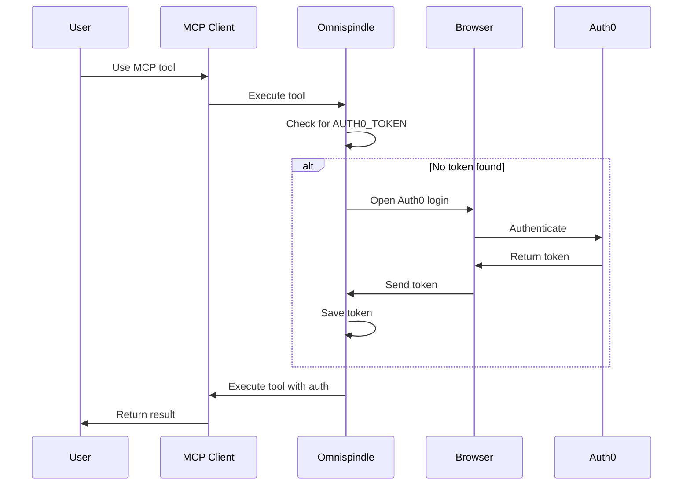

# Authenticating MCP Clients with Auth0

Omnispindle provides seamless authentication for MCP clients like Claude Desktop. When you try to use MCP tools without authentication, it automatically opens your browser to log in.

## Automatic Authentication

When you first use Omnispindle MCP tools without authentication:

1. **Browser Opens Automatically**: The system detects you're not authenticated and opens your browser to the Auth0 login page
2. **Log In**: Use your existing credentials or sign up with Google
3. **Return to Terminal**: After successful login, you're automatically redirected and can close the browser
4. **Token Saved**: Your authentication token is saved locally for future use

This happens automatically - no manual setup required!

## How It Works



## First-Time Setup

Just configure your MCP client to use Omnispindle:

```json
{
  "mcpServers": {
    "omnispindle": {
      "command": "python",
      "args": ["-m", "src.Omnispindle.stdio_server"],
      "cwd": "/path/to/Omnispindle"
    }
  }
}
```

That's it! No need to manually set tokens or environment variables. The first time you use an Omnispindle tool, you'll be prompted to authenticate.

## Manual Token Management (Optional)

If you prefer to manage tokens manually, you can still set the `AUTH0_TOKEN` environment variable:

```bash
export AUTH0_TOKEN="your_token_here"
```

Or include it in your MCP configuration:

```json
{
  "mcpServers": {
    "omnispindle": {
      "command": "python",
      "args": ["-m", "src.Omnispindle.stdio_server"],
      "env": {
        "AUTH0_TOKEN": "your_token_here"
      }
    }
  }
}
```

## Token Persistence

Once you authenticate:
- The token is saved to `.env` in the project root
- It's automatically loaded for future sessions
- Tokens typically last several hours before requiring re-authentication

## Troubleshooting

### Browser doesn't open
If the browser doesn't open automatically, the authentication URL will be printed to the console. Copy and paste it into your browser manually.

### Port conflict
The callback server uses port 8765 by default. If this port is in use, you may need to modify the `CALLBACK_PORT` in `auth_flow.py`.

### Token expired
When your token expires, simply use any MCP tool again and you'll be prompted to re-authenticate.

## Security Notes

- Tokens are stored locally in your project's `.env` file
- Each user gets their own Auth0 identity
- All authentication happens through Auth0's secure OAuth2 flow
- Tokens expire after a few hours for security

## For AI Agents

AI agents can handle the authentication flow programmatically:

```python
from src.Omnispindle.auth_flow import ensure_authenticated

# This will trigger browser auth if needed
token = ensure_authenticated()

# Use the token for MCP operations
os.environ['AUTH0_TOKEN'] = token
``` 
